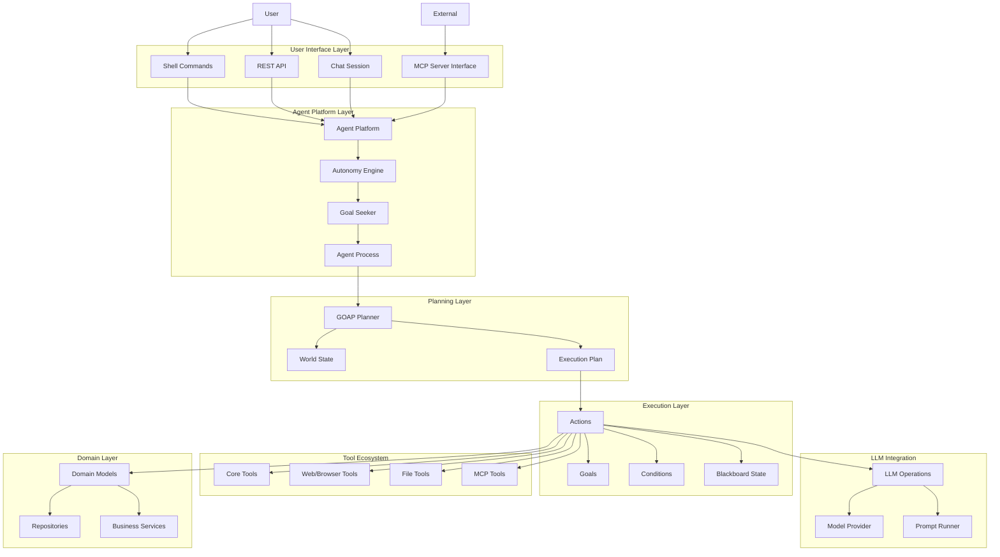
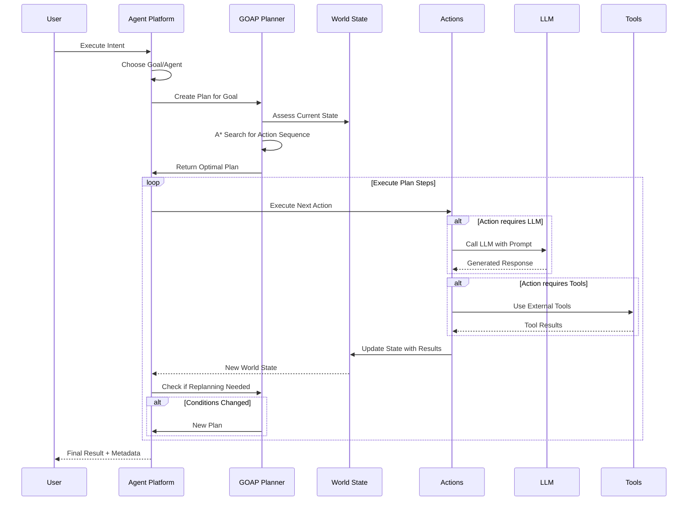
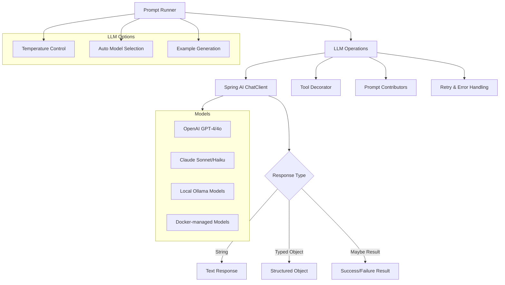
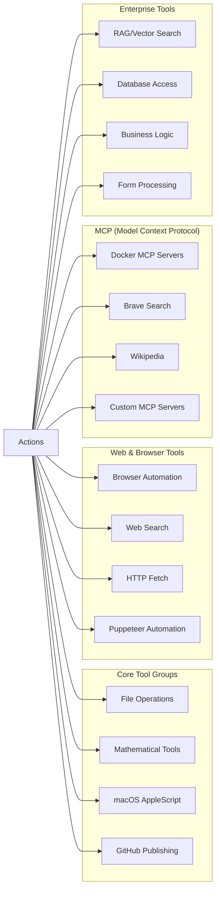
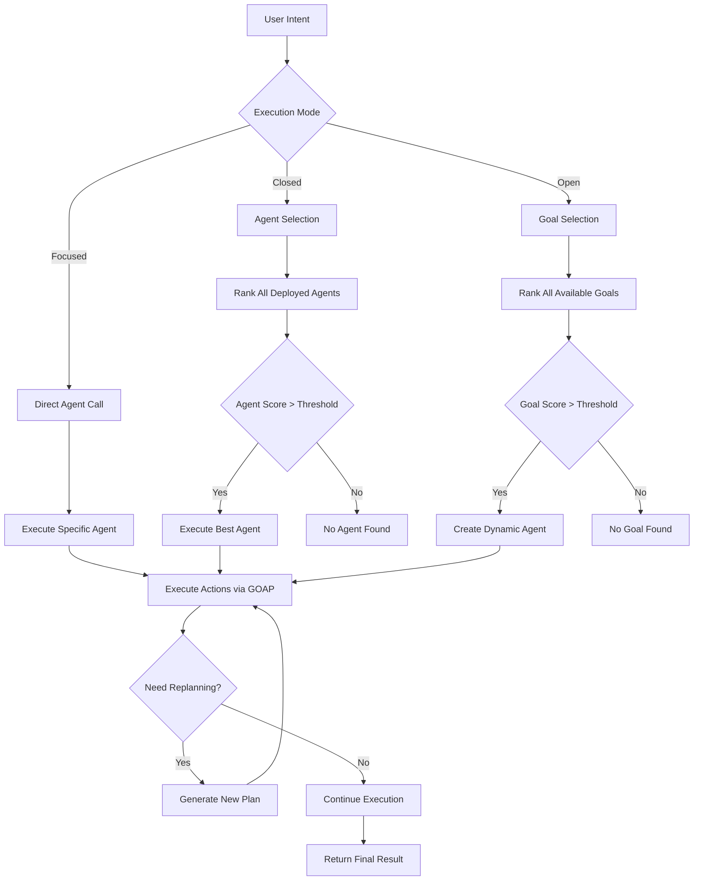

# Embabel Agent Framework: Architecture and Capabilities Analysis

## Table of Contents
- [Overview](#overview)
- [What It Does](#what-it-does)
- [Core Architecture](#core-architecture)
- [Key Concepts](#key-concepts)
- [Programming Models](#programming-models)
- [LLM Integration](#llm-integration)
- [Streaming Support Analysis](#streaming-support-analysis)
- [Tool Ecosystem](#tool-ecosystem)
- [Execution Modes](#execution-modes)
- [Key Differentiators](#key-differentiators)
- [Technology Stack](#technology-stack)
- [Getting Started](#getting-started)

## Overview

The **Embabel Agent Framework** is a sophisticated JVM-based framework for building AI agents that combine Large Language Models (LLMs) with traditional code and domain models. Built with Kotlin and Spring Boot, it provides a unique approach to agentic systems through intelligent planning algorithms and strong typing.

## What It Does

### Primary Capabilities
- **Intelligent Planning**: Uses Goal-Oriented Action Planning (GOAP) AI algorithm from gaming industry
- **Multi-LLM Support**: Integrates with OpenAI, Anthropic, Ollama, and Docker-based models
- **Tool Integration**: Extensive support for external tools via Model Context Protocol (MCP)
- **Enterprise Ready**: Built on Spring Boot with dependency injection, transaction management
- **Type-Safe Development**: Strongly typed with full refactoring support, eliminates "magic maps"
- **Flexible Programming Models**: Choose between annotation-based (@Agent, @Action) or Kotlin DSL

### Use Cases
- **Intelligent Automation**: Automate complex business processes with AI-driven decision making
- **Research Agents**: Build agents that can research topics, fact-check information, gather data
- **Content Generation**: Create personalized content based on user preferences and real-time data
- **Enterprise Integration**: Connect AI capabilities to existing business systems and databases
- **Multi-step Workflows**: Orchestrate complex workflows that adapt based on intermediate results

## Core Architecture



### Architecture Layers Explained

1. **User Interface Layer**: Multiple ways to interact with agents (shell, web API, chat, MCP)
2. **Agent Platform Layer**: Core orchestration and agent lifecycle management
3. **Planning Layer**: GOAP-based intelligent planning and replanning
4. **Execution Layer**: Runtime execution of actions with state management
5. **LLM Integration**: Abstracted LLM operations supporting multiple providers
6. **Tool Ecosystem**: Extensible tool system for external integrations
7. **Domain Layer**: Business logic and data persistence

## Key Concepts

### Agent System Components

```mermaid
classDiagram
    class Agent {
        +String name
        +String description
        +Set~Goal~ goals
        +List~Action~ actions
        +Set~Condition~ conditions
        +GoapPlanningSystem planningSystem
        +withSingleGoal(Goal): Agent
        +pruneTo(GoapPlanningSystem): Agent
    }
    
    class Action {
        +String name
        +String description
        +Set~IoBinding~ inputs
        +Set~IoBinding~ outputs
        +EffectSpec preconditions
        +EffectSpec effects
        +ZeroToOne cost
        +boolean canRerun
        +ActionQos qos
        +run(ProcessContext): Any
    }
    
    class Goal {
        +String name
        +String description
        +Set~String~ pre
        +Set~IoBinding~ inputs
        +ZeroToOne value
        +EffectSpec preconditions
        +withPrecondition(String): Goal
        +withValue(Double): Goal
    }
    
    class Condition {
        +String name
        +String description
        +evaluate(ProcessContext): ConditionDetermination
    }
    
    class AgentPlatform {
        +deploy(Agent): AgentPlatform
        +runAgentFrom(Agent, ProcessOptions, Map): AgentProcess
        +runAgentWithInput(Agent, ProcessOptions, Any): AgentProcess
        +agents(): List~Agent~
        +goals: Set~Goal~
        +actions: List~Action~
        +createChildProcess(Agent, AgentProcess): AgentProcess
    }
    
    Agent ||--o{ Action
    Agent ||--o{ Goal
    Agent ||--o{ Condition
    AgentPlatform ||--o{ Agent
    
    class IoBinding {
        +String name
        +String type
        +String value
    }
    
    Action ||--o{ IoBinding
    Goal ||--o{ IoBinding
```

### GOAP Planning Process



### Core Concepts Explained

- **Agent**: A collection of actions, goals, and conditions that can be deployed to a platform
- **Action**: Individual steps that can be executed, with preconditions and effects
- **Goal**: What the agent is trying to achieve, with success criteria
- **Condition**: Boolean predicates that determine when actions can run or goals are met
- **Blackboard**: Shared state/memory where objects are stored and accessed during execution
- **IoBinding**: Type-safe bindings that define inputs and outputs for actions and goals
- **GOAP (Goal-Oriented Action Planning)**: AI planning algorithm that finds optimal action sequences

## Programming Models

### 1. Annotation-Based Model (Recommended)

The annotation-based model uses Spring-style annotations to define agents:

```kotlin
@Agent(description = "Find news based on a person's star sign")
class StarNewsFinder(
    // Spring dependency injection works seamlessly
    private val horoscopeService: HoroscopeService,
    @Value("\${story.count:5}")
    private val storyCount: Int,
) {

    @Action
    fun extractPerson(userInput: UserInput): StarPerson? =
        PromptRunner().createObjectIfPossible(
            "Create a person from this user input: ${userInput.content}"
        )

    @Action(toolGroups = [CoreToolGroups.WEB])
    fun findNewsStories(person: StarPerson, horoscope: Horoscope): RelevantNewsStories =
        PromptRunner().createObject(
            """
            Find $storyCount relevant news stories for ${person.name} 
            based on their horoscope: ${horoscope.summary}
            Use web tools to search and summarize.
            """
        )

    @AchievesGoal(description = "Create amusing writeup")
    @Action
    fun writeup(
        person: StarPerson, 
        stories: RelevantNewsStories, 
        horoscope: Horoscope
    ): Writeup =
        PromptRunner()
            .withTemperature(1.2)
            .createObject("Create an amusing writeup combining the horoscope and news...")
}
```

**Key Annotations:**
- `@Agent`: Marks a class as an agent
- `@Action`: Defines executable steps
- `@Goal`: Defines what the agent is trying to achieve
- `@Condition`: Defines when actions can run
- `@AchievesGoal`: Marks an action as completing a goal

### 2. Kotlin DSL Model

For more programmatic control:

```kotlin
val starNewsAgent = agent {
    name = "StarNewsFinder"
    description = "Find news based on star sign"
    
    action("extractPerson") {
        description = "Extract person from user input"
        inputs = setOf(IoBinding("input", UserInput::class))
        outputs = setOf(IoBinding("person", StarPerson::class))
        
        runner = { context ->
            val input = context.blackboard.get<UserInput>("input")
            // LLM call to extract person
            promptRunner.createObject<StarPerson>("Extract person: $input")
        }
    }
    
    action("findNews") {
        description = "Find relevant news stories"
        inputs = setOf(
            IoBinding("person", StarPerson::class),
            IoBinding("horoscope", Horoscope::class)
        )
        outputs = setOf(IoBinding("stories", RelevantNewsStories::class))
        toolGroups = setOf(CoreToolGroups.WEB)
        
        runner = { context ->
            val person = context.blackboard.get<StarPerson>("person")
            val horoscope = context.blackboard.get<Horoscope>("horoscope")
            // Implementation
        }
    }
    
    goal("createWriteup") {
        description = "Create amusing writeup"
        requires = setOf(StarPerson::class, RelevantNewsStories::class)
        value = 1.0
    }
}
```

### 3. Domain Models

Both programming models work with strongly-typed domain objects:

```kotlin
@JsonClassDescription("Person with astrology details")
data class StarPerson(
    override val name: String,
    @get:JsonPropertyDescription("Star sign")
    val sign: String,
) : Person

data class Horoscope(
    val summary: String,
)

data class RelevantNewsStories(
    val items: List<NewsStory>
)

data class NewsStory(
    val url: String,
    val summary: String,
)

data class Writeup(
    override val content: String,
) : HasContent
```

## LLM Integration

### Architecture



### Usage Patterns

#### Basic Text Generation
```kotlin
val response = PromptRunner().generate("Explain quantum computing")
```

#### Structured Object Creation
```kotlin
val person = PromptRunner().createObject<Person>(
    "Extract person details from: John Smith, age 30, lives in Seattle"
)
```

#### Conditional Object Creation
```kotlin
val result = PromptRunner().createObjectIfPossible<Product>(
    "Find product details for item XYZ-123"
)
when {
    result.isSuccess -> println("Found: ${result.getOrNull()}")
    result.isFailure -> println("Could not find product")
}
```

#### Custom LLM Options
```kotlin
val writeup = PromptRunner()
    .withTemperature(0.9)              // More creative
    .withModel("gpt-4o")               // Specific model
    .createObject<Writeup>("Write an amusing story...")
```

#### Tool Integration
```kotlin
@Action(toolGroups = [CoreToolGroups.WEB, CoreToolGroups.BROWSER_AUTOMATION])
fun researchTopic(topic: String): ResearchReport =
    PromptRunner().createObject(
        "Research $topic using web search and browser tools. Provide sources."
    )
```

### Supported LLM Providers

1. **OpenAI**: GPT-4, GPT-4o, GPT-4-mini, GPT-3.5-turbo
2. **Anthropic**: Claude 3.5 Sonnet, Claude 3 Haiku
3. **Ollama**: Local models (Llama, Mistral, Code Llama, etc.)
4. **Docker**: Container-managed models with Docker Desktop integration

## Streaming Support Analysis

### Current Status: **NO STREAMING SUPPORT**

Based on comprehensive code analysis, the Embabel Agent Framework **does not currently support streaming LLM responses**.

#### Evidence:
1. **Synchronous Operations**: All LLM calls use blocking `ChatClient.call()` methods
2. **No Reactive Dependencies**: No Spring WebFlux, Reactor, or streaming libraries
3. **Return Types**: Methods return completed objects, not reactive streams
4. **Architecture Design**: Built around complete request-response cycles

#### Current Implementation:
```kotlin
// From ChatClientLlmOperations.kt - No streaming
val callResponse = resources.chatClient
    .prompt(springAiPrompt)
    .toolCallbacks(interaction.toolCallbacks)
    .call()  // Blocking call - waits for complete response
```

#### What Would Be Needed for Streaming:
1. **Reactive Programming Model**: Integration with Spring WebFlux/Reactor
2. **Streaming Interfaces**: Methods returning `Flux<String>` or similar
3. **Incremental Processing**: Handle partial responses and progressive updates
4. **Event-Driven Architecture**: Real-time updates to UI components
5. **Buffering Strategy**: Manage partial token/word boundaries

#### Potential Future Implementation:
```kotlin
// Hypothetical streaming interface
interface StreamingLlmOperations {
    fun generateStream(prompt: String): Flux<String>
    fun createObjectStream<T>(prompt: String, clazz: Class<T>): Flux<PartialObject<T>>
}
```

### Workarounds for Real-time Feedback:
1. **Progress Events**: Use the event system to provide progress updates
2. **Chunked Processing**: Break large tasks into smaller actions
3. **Polling**: Check process status periodically
4. **Logging**: Real-time logging shows progress in shell mode

## Tool Ecosystem

### Tool Architecture



### Built-in Tool Groups

#### Core Tools (`CoreToolGroups`)
- **FILE**: File system operations (read, write, list, search)
- **MATH**: Mathematical calculations and computations
- **WEB**: Web search and HTTP operations
- **BROWSER_AUTOMATION**: Automated browser interactions
- **PUBLISH**: GitHub and version control operations

#### File Tools Example
```kotlin
@Action(toolGroups = [CoreToolGroups.FILE])
fun analyzeProject(projectPath: String): ProjectAnalysis =
    PromptRunner().createObject(
        "Analyze the project structure at $projectPath. Use file tools to explore."
    )
```

### MCP (Model Context Protocol) Integration

The framework provides first-class support for MCP servers:

#### Configuration
```yaml
spring:
  ai:
    mcp:
      client:
        enabled: true
        stdio:
          connections:
            docker-mcp:
              command: docker
              args:
                - run
                - -i
                - --rm
                - alpine/socat
                - STDIO
                - TCP:host.docker.internal:8811
```

#### Available MCP Tools
- **Docker MCP Catalog**: 100+ verified tools from Docker ecosystem
- **Brave Search**: Web search with privacy focus
- **Puppeteer**: Advanced browser automation
- **Wikipedia**: Knowledge base access
- **Custom Servers**: Build your own MCP integrations

### Custom Tool Development

#### Create Custom Tool Groups
```kotlin
@Component
class CustomToolGroup : ToolGroup {
    override val metadata = ToolGroupMetadata(
        role = "custom-business",
        description = "Custom business tools"
    )
    
    override val tools = listOf(
        // Your custom tools
    )
}
```

#### Tool Registration
```kotlin
@Configuration
class ToolConfiguration {
    
    @Bean
    fun customToolGroupResolver(): ToolGroupResolver =
        RegistryToolGroupResolver().apply {
            register(CustomToolGroup())
        }
}
```

## Execution Modes

The framework supports three distinct execution modes:



### Mode Details

#### 1. Focused Mode
- **Use Case**: Direct agent invocation for known tasks
- **Selection**: User specifies exact agent to run
- **Scope**: Limited to actions within that specific agent
- **Example**: `autonomy.runAgent(starNewsAgent, processOptions, userInput)`

#### 2. Closed Mode (Default)
- **Use Case**: Automatic agent selection from deployed agents
- **Selection**: Platform ranks all deployed agents by relevance
- **Scope**: Actions from the best-matching agent only
- **Example**: Shell command `execute "find news for Lynda the Scorpio"`

#### 3. Open Mode (Most Powerful)
- **Use Case**: Maximum flexibility and capability
- **Selection**: Platform ranks all available goals across all agents
- **Scope**: Can use any action from any agent to achieve the goal
- **Example**: Shell command `execute "research topic XYZ" --open`

### Configuration

```kotlin
// Set execution mode in shell
setOptions --open true    // Enable open mode
execute "complex task"    // Will use open mode

// Or programmatically
val result = autonomy.chooseAndAccomplishGoal(
    intent = "research quantum computing",
    processOptions = ProcessOptions(),
    goalChoiceApprover = GoalChoiceApprover.APPROVE_ALL,
    agentScope = agentPlatform  // All available agents
)
```

## Key Differentiators

### 1. True AI Planning (Not Just Sequential Execution)
- **GOAP Algorithm**: Uses proven gaming AI for dynamic planning
- **Adaptive**: Replans based on changing conditions and new information
- **Optimal Paths**: Finds cost-effective action sequences automatically

### 2. Superior Extensibility
- **No Code Changes**: Adding new actions/goals extends capability without modifying existing code
- **Dynamic Composition**: Open mode can combine actions from different agents
- **Plugin Architecture**: Easy integration of new tools and capabilities

### 3. Strong Typing Benefits
- **Compile-time Safety**: Catch errors during development, not runtime
- **IDE Support**: Full refactoring, autocomplete, and navigation
- **Domain Modeling**: Rich object-oriented domain models with behavior

### 4. Enterprise Integration
- **Spring Boot Foundation**: Leverage existing Spring ecosystem
- **Dependency Injection**: Proper IoC container management
- **Transaction Support**: Database transactions and consistency
- **Testing Framework**: Built-in support for unit and integration testing

### 5. Multi-LLM Architecture
- **Cost Optimization**: Use different models for different tasks
- **Fallback Support**: Automatic failover between providers
- **Local Models**: Support for privacy-conscious local deployments

### 6. Production Ready
- **Observability**: Comprehensive logging and monitoring
- **Error Handling**: Robust retry policies and error recovery
- **Resource Management**: Efficient memory and compute usage
- **Security**: Sandboxed tool execution and permission management

## Technology Stack

### Core Technologies
- **JDK 21**: Latest Java features and performance improvements
- **Kotlin**: Primary development language with excellent Java interop
- **Spring Boot 3.x**: Modern Spring framework with GraalVM support
- **Spring AI**: LLM integration and tool support
- **Maven**: Build and dependency management

### LLM Providers
- **OpenAI**: GPT-4, GPT-4o models via official API
- **Anthropic**: Claude 3.5 Sonnet, Claude 3 Haiku
- **Ollama**: Local model hosting (Llama, Mistral, etc.)
- **Docker**: Container-based model deployment

### External Integrations
- **MCP (Model Context Protocol)**: Standardized tool integration
- **Docker**: Container orchestration and tool isolation
- **Vector Databases**: RAG and semantic search capabilities
- **Web Technologies**: Browser automation and web scraping

### Development Tools
- **Jackson**: JSON serialization with schema generation
- **SLF4J + Logback**: Comprehensive logging framework
- **JUnit 5**: Modern testing framework
- **Spring Test**: Integration testing support

## Getting Started

### Prerequisites
- JDK 21 or later
- Maven 3.6+ or Gradle 7+
- Docker Desktop (for MCP tools)
- API keys for LLM providers

### Quick Start

1. **Clone the Repository**
```bash
git clone https://github.com/embabel/embabel-agent
cd embabel-agent
```

2. **Set Environment Variables**
```bash
export OPENAI_API_KEY="your-openai-key"
export ANTHROPIC_API_KEY="your-anthropic-key"
```

3. **Run the Shell**
```bash
cd scripts
./shell.sh
```

4. **Try Example Commands**
```bash
# In the shell
execute "Lynda is a Scorpio, find news for her" -p -r
chat
demo
```

### Maven Integration

Add to your `pom.xml`:
```xml
<dependencyManagement>
    <dependencies>
        <dependency>
            <groupId>com.embabel.agent</groupId>
            <artifactId>embabel-agent-dependencies</artifactId>
            <version>1.0.0-SNAPSHOT</version>
            <type>pom</type>
            <scope>import</scope>
        </dependency>
    </dependencies>
</dependencyManagement>

<dependencies>
    <dependency>
        <groupId>com.embabel.agent</groupId>
        <artifactId>embabel-agent-api</artifactId>
    </dependency>
</dependencies>

<repositories>
    <repository>
        <id>embabel-snapshots</id>
        <url>https://repo.embabel.com/artifactory/libs-snapshot</url>
        <snapshots><enabled>true</enabled></snapshots>
    </repository>
</repositories>
```

### Creating Your First Agent

```kotlin
@Agent(description = "Simple greeting agent")
@Component
class GreetingAgent {
    
    @Action
    fun extractName(userInput: UserInput): PersonName? =
        PromptRunner().createObjectIfPossible(
            "Extract the person's name from: ${userInput.content}"
        )
    
    @AchievesGoal(description = "Create personalized greeting")
    @Action
    fun createGreeting(name: PersonName): Greeting =
        PromptRunner().createObject(
            "Create a friendly, personalized greeting for ${name.value}"
        )
}

data class PersonName(val value: String)
data class Greeting(val message: String)
```

### Running Your Agent

```kotlin
// In your application
@SpringBootApplication
class MyAgentApp

fun main(args: Array<String>) {
    runApplication<MyAgentApp>(*args)
}

// Usage
@Autowired
lateinit var autonomy: Autonomy

val result = autonomy.chooseAndRunAgent(
    intent = "Hello, my name is Alice",
    processOptions = ProcessOptions()
)
```

---

## Conclusion

The Embabel Agent Framework represents a significant advancement in JVM-based AI agent development. Its combination of intelligent planning, strong typing, enterprise integration, and extensible architecture makes it uniquely suited for production AI applications.

While it currently lacks streaming LLM support, its robust foundation provides an excellent platform for building sophisticated AI agents that can adapt, plan, and execute complex workflows in enterprise environments.

For more information, examples, and detailed documentation, visit the [Embabel Agent GitHub repository](https://github.com/embabel/embabel-agent).

---

*Generated through comprehensive code analysis and research of the Embabel Agent Framework*
